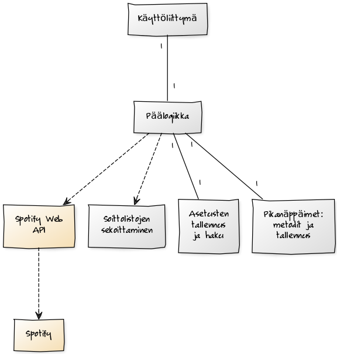
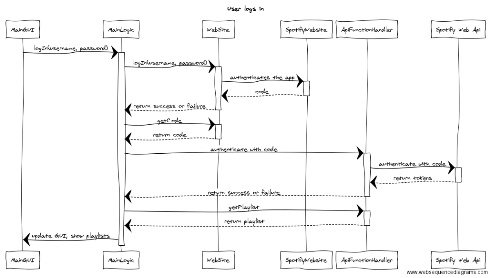
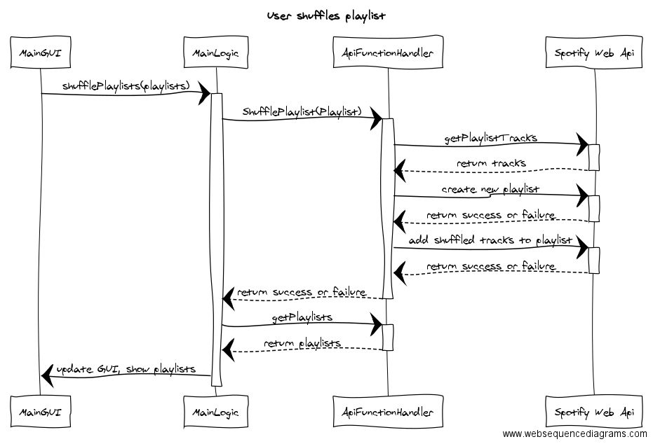

# SpotifySysteemi

**Aihe**: Spotify hotkey-ohjelma, jossa myös parempi kappaleiden randomaus -toiminto. Ohjelma toimii spotifyn web-rajapintaa käyttäen. Ohjelmassa voi mm. asettaa global pikanäppäimiä, mikä ei ole mahdollista pelkkää spotifytä käyttämällä.

**Käyttäjät**: Spotifyn käyttäjä

**Kaikkien käyttäjien toiminnot**: Pikanäppäinten käyttö, asetus, randomaus, spotifyhyn kirjautuminen

